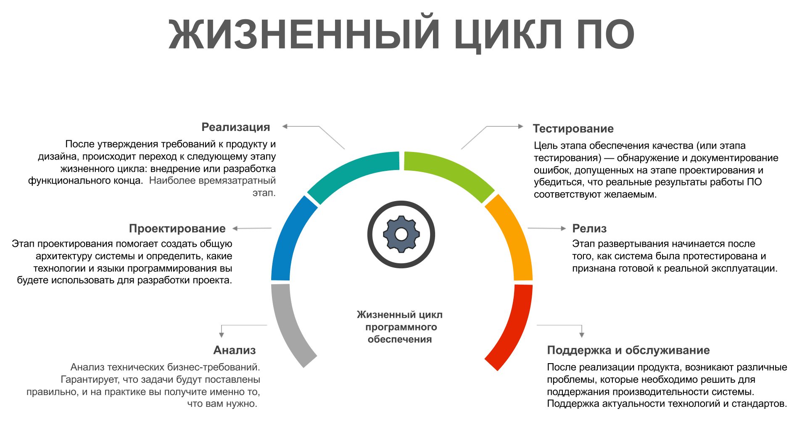
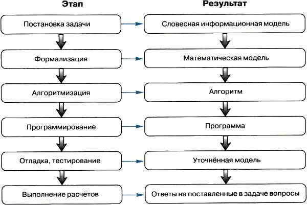

# Жизненный цикл программы, программный продукт и его характеристики, основные этапы решения задач на компьютере
## Введение
Разработка программного обеспечения (ПО) - это сложный и многогранный процесс, включающий множество этапов и аспектов. В данной лекции мы рассмотрим основные понятия, связанные с жизненным циклом программы, программным продуктом, его характеристиками, а также основные этапы решения задач на компьютере.
## 1. Жизненный цикл программы
Жизненный цикл программы — это совокупность стадий разработки и эксплуатации программного обеспечения, которые проходят с момента возникновения идеи о создании программы до завершения ее использования. Жизненный цикл программы можно представить в виде последовательности следующих этапов:
1.	Формулирование требований:
    -	Определение задач, которые должна решать программа.
    -	Выявление требований к функциональности, производительности, безопасности, интерфейсу и другим аспектам.
2.	Анализ и проектирование:
    -	Моделирование системы, создание архитектуры программы.
    -	Определение структуры данных, алгоритмов, проектирование интерфейсов и модулей.
3.	Реализация (кодирование):
    -	Непосредственная разработка кода программы на выбранном языке программирования.
    -	Написание и тестирование отдельных модулей программы.
4.	Тестирование:
    -	Проверка работоспособности программы, выявление ошибок.
    -	Тестирование функциональности, производительности, безопасности и других аспектов.
5.	Внедрение (развертывание):
    -	Установка программы на рабочие места пользователей.
    -	Настройка программного обеспечения и обучение пользователей.
6.	Эксплуатация и сопровождение:
    -	Работа с программой в реальных условиях.
    -	Внесение изменений, исправление ошибок, обновление программы в процессе ее эксплуатации.
7.	Завершение эксплуатации:
    -	Оценка возможности и необходимости дальнейшего использования программы.
    -	Деактивация или замена программы.

    
## 2. Программа и программный продукт
Программа — это набор инструкций, написанных на языке программирования, которые выполняются компьютером для решения определенной задачи или набора задач.

Программный продукт — это программа или совокупность программ, которые прошли стадии разработки, тестирования и внедрения, и предназначены для использования конечными пользователями. Программный продукт включает не только саму программу, но и сопутствующую документацию, инструкции по установке, лицензии, и т. д.

Характеристики программного продукта:
1.	Функциональность:
    -	Соответствие программы поставленным задачам и требованиям.
    -	Поддержка всех необходимых функций.
2.	Надежность:
    -	Способность программы выполнять свои функции без сбоев и ошибок.
    -	Устойчивость к некорректным действиям пользователей.
3.	Производительность:
    -	Эффективность выполнения программы в плане времени выполнения задач и использования ресурсов (память, процессорное время).
4.	Удобство использования:
    -	Понятный и интуитивный интерфейс.
    -	Удобство взаимодействия с программой для пользователя.
5.	Совместимость:
    -	Способность программы взаимодействовать с другими программами и аппаратными средствами.
    -	Поддержка различных операционных систем и платформ.
6.	Безопасность:
    -	Защищенность программы от несанкционированного доступа и угроз.
    -	Защита данных пользователей.
7.	Сопровождаемость:
    -	Легкость внесения изменений и обновлений в программу.
    -	Поддержка и развитие программы в течение ее жизненного цикла.
## 3. Основные этапы решения задач на компьютере
Решение задач на компьютере также проходит через определенные этапы. Эти этапы включают:
1. Постановка задачи:
    -	Определение цели задачи и формулировка условий на естественном языке, включая описание исходных данных и требований к результату.
    -	Результат: Словесная информационная модель.
2. Формализация:
    -	Преобразование словесной модели в математическую форму, включающую формулы, уравнения и другие математические конструкции, которые будут использоваться для решения задачи.
    -	Результат: Математическая модель.
3. Алгоритмизация:
    -	Разработка последовательности шагов (алгоритма), которые необходимо выполнить для решения задачи на основе математической модели.
    -	Результат: Алгоритм.
4. Программирование:
    -	Реализация алгоритма на языке программирования с созданием программы, которая будет выполнять необходимые вычисления и операции.
    -	Результат: Программа.
5. Отладка и тестирование:
    -	Проверка программы на наличие ошибок, тестирование на различных наборах данных и при необходимости корректировка программы и модели для обеспечения точности и стабильности.
    -  	Результат: Уточнённая модель.
6. Выполнение расчётов:
    -	Использование отлаженной программы для проведения расчётов и получения итоговых результатов, которые соответствуют целям задачи.
    -	Результат: Ответы на поставленные в задаче вопросы.

## Заключение
Знание жизненного цикла программы, характеристик программного продукта и основных этапов решения задач на компьютере является фундаментом для понимания процессов разработки программного обеспечения. Это позволяет разработчикам создавать качественные, эффективные и надежные программные продукты, удовлетворяющие требованиям пользователей и рынков.
