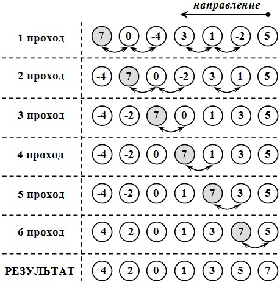
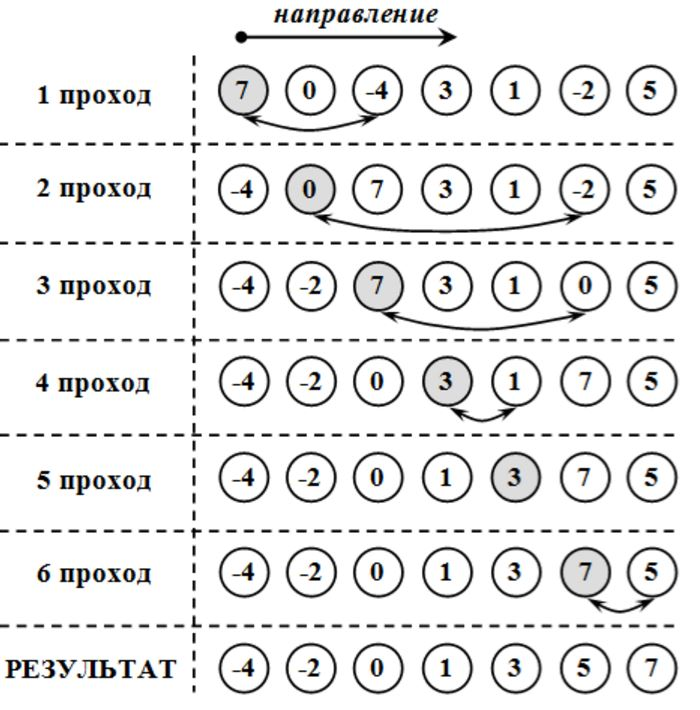
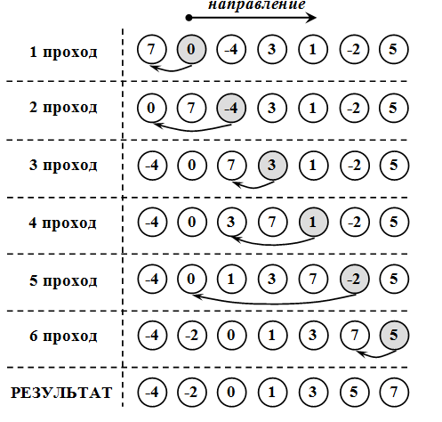

# Алгоритмы сортировки массивов

## Сортировка Пузырьком

**Сортировка пузырько́м** (bubble sort),  **сортиро́вка простыми обменами** , **метод сортировки обменами**.
По сравнению с другими алгоритмами считается простейшим для понимания и реализации. Эффективен для массивов небольшого размера. n — размер массива, количество элементов массива. Сложность алгоритма - $O(n^2)$

#### Суть алгоритма

1. Выполняется некоторое количество проходов по массиву — начиная от начала массива, перебираются пары соседних элементов массива. Если 1-й элемент пары больше 2-го, элементы переставляются (выполняется обмен).
2. Пары элементов массива перебираются (проходы по массиву повторяются) либо $(n−1)$ раз, либо до тех пор, пока на очередном проходе не обнаружится, что более не требуется выполнять перестановки (обмены) (массив отсортирован).
3. При каждом проходе алгоритма по внутреннему циклу очередной наибольший элемент массива ставится на своё место в конце массива рядом с предыдущим «наибольшим элементом», а наименьший элемент перемещается на одну позицию к началу массива (как бы «всплывает» до нужной позиции, как пузырёк в воде — откуда и название алгоритма).

## Сортировка выбором

Сортировка выбором (англ. selection sort) — алгоритм сортировки. Может быть как устойчивый, так и неустойчивый. На массиве из
$n$ элементов имеет время выполнения в худшем, среднем и лучшем случае $O(n^2)$, предполагая что сравнения делаются за постоянное время.

#### Шаги алгоритма:

1. Находим номер минимального значения в текущем списке.
2. Производим обмен этого значения со значением первой неотсортированной позиции (обмен не нужен, если минимальный элемент уже находится на данной позиции).
3. Теперь сортируем хвост списка, исключив из рассмотрения уже отсортированные элементы.

## Сортировка вставками

Сортировка вставками (Insertion sort) — алгоритм сортировки, в котором элементы входной последовательности просматриваются по одному, и каждый новый поступивший элемент размещается в подходящее место среди ранее упорядоченных элементов. Вычислительная сложность — $O(n^2)$.

#### Суть алгоритма:

1. Перебираются элементы в неотсортированной части массива.
2. Каждый элемент вставляется в отсортированную часть массива на то место, где он должен находиться.

