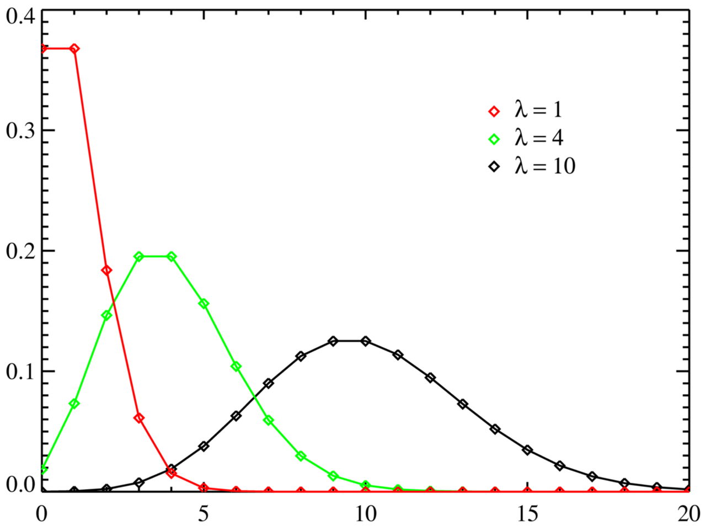
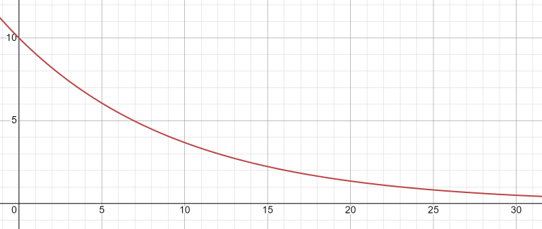
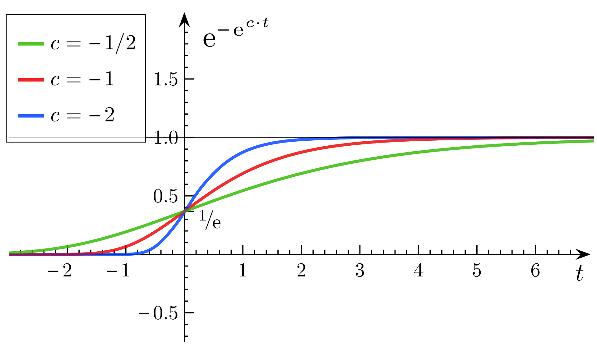

### Лекция: Математические модели описания статистических характеристик ошибок в программах

#### Введение

Качество программного обеспечения (ПО) играет важную роль в современных технологиях, а одним из его ключевых аспектов является надежность. Надежность тесно связана с количеством и характером ошибок, которые могут присутствовать в программном коде. Математические модели позволяют не только описывать статистические характеристики ошибок, но и прогнозировать их появление, что помогает в планировании тестирования и повышения качества ПО.

#### 1. Основные понятия

1. **Ошибка (bug)** — это дефект в программе, который приводит к её некорректному поведению.
2. **Интенсивность появления ошибок** — это частота возникновения ошибок в программе в зависимости от времени или количества выполненных операций.
3. **Надежность программы** — вероятность того, что программа будет выполнять свои функции без ошибок в течение определённого времени.

### 2. Модели ошибок в программном обеспечении

Математические модели ошибок позволяют количественно оценивать частоту ошибок и их влияние на надежность программы. Основные статистические модели включают в себя:

1. **Модель Пуассона**
2. **Модель Джелински-Моранды**
3. **Модель Логарифмического распределения**
4. **Модель Мусялы**
5. **Модель Шумана**

#### 2.1. Модель Пуассона

Модель Пуассона — одна из самых простых и широко используемых для описания частоты появления ошибок. Она предполагает, что количество ошибок, обнаруженных в ПО за определенный интервал времени, следует распределению Пуассона. Это распределение описывает вероятность того, что за фиксированный промежуток времени произойдет определенное число событий (в данном случае, обнаружение ошибок), при условии, что эти события происходят независимо друг от друга с постоянной средней интенсивностью.

**Формула:**
```math
P(k, \lambda) = \frac{\lambda^k e^{-\lambda}}{k!}
```
Где:
-  $P(k, \lambda)$ — вероятность того, что произойдет $k$ ошибок за интервал времени;
- $\lambda$ — среднее число ошибок за интервал времени.

##### Применение

Модель Пуассона наиболее эффективна на ранних стадиях тестирования, когда ошибки в коде еще многочисленны и выявляются случайным образом. Например, в проекте, где код только что был завершен и начал проходить первичное тестирование, распределение ошибок может следовать закону Пуассона. 

##### График

На графике ниже показана вероятность обнаружения различных количеств ошибок $k$ при различных значениях среднего числа ошибок $\lambda$:



##### Пример:
Допустим, среднее число ошибок в программе за неделю равно $\lambda = 5$. Вероятность того, что за следующую неделю будет найдено ровно 3 ошибки, рассчитывается по формуле Пуассона:
```math
P(3, 5) = \frac{5^3 e^{-5}}{3!} = 0.14
```
Таким образом, вероятность найти ровно 3 ошибки за неделю составляет 14%.

#### 2.2. Модель Джелински-Моранды

Модель Джелински-Моранды описывает процесс отладки программного обеспечения, где количество оставшихся ошибок уменьшается с каждым исправлением. Она предполагает, что каждая найденная ошибка уменьшает вероятность появления следующих ошибок.

**Формула:**
```math
\lambda(t) = \lambda_0 e^{-\alpha t}
```
Где:
- $\lambda(t)$ — интенсивность появления ошибок в момент времени $t$;
- $\lambda_0$ — начальная интенсивность ошибок;
- $\alpha$ — коэффициент снижения интенсивности ошибок.

##### Применение

Модель Джелински-Моранды хорошо подходит для оценки остаточного количества ошибок в ПО и прогноза необходимого времени тестирования для достижения заданного уровня надежности. Она используется в критически важных системах, где важно оценить надежность перед выпуском, например, в авиационных системах или ПО для медицинских устройств.

##### График

График модели Джелински-Моранды показывает, как интенсивность обнаружения ошибок снижается с течением времени, отражая уменьшение общего числа оставшихся ошибок:



##### Пример:
Пусть начальная интенсивность ошибок $\lambda_0 = 10$ ошибок в час, а $\alpha = 0.1$. Через 5 часов тестирования интенсивность ошибок будет:
```math
\lambda(5) = 10 e^{-0.1 \cdot 5} = 6.07 \text{ ошибок в час}
```
Эта модель показывает, как интенсивность ошибок уменьшается по мере того, как программа отлаживается.


#### 2.3. Модель Рэлея

Модель Рэлея описывает распределение времени до обнаружения ошибок, основываясь на предположении, что вероятность ошибки связана с экспоненциальным распределением. Эта модель лучше подходит для ситуаций, когда интенсивность обнаружения ошибок уменьшается со временем, что отражает улучшение качества ПО в процессе тестирования.

```math
f(t) = \frac{t}{\sigma^2} e^{-\frac{t^2}{2\sigma^2}}
```

где $\sigma$ — параметр масштаба.

##### Применение

Эта модель часто используется для анализа надежности систем, где скорость обнаружения ошибок изменяется со временем, например, при длительном тестировании сложных систем. В реальных проектах, таких как разработка встроенных систем, тестирование может начинаться с интенсивного обнаружения ошибок, которое постепенно уменьшается, что хорошо описывается моделью Рэлея.

##### График

На графике ниже показано распределение Рэлея для различных значений параметра $sigma$:


#### 2.4. Модель Гомпертца

Модель Гомпертца используется для описания процесса выявления ошибок с учетом влияния таких факторов, как обучение тестировщиков или улучшение инструментов тестирования.

```math
N(t) = N_0 e^{-b e^{-ct}}
```

где:
- $N(t)$ — количество обнаруженных ошибок к моменту времени $t$,
- $N_0$ — максимальное возможное количество ошибок,
- $b$ и $c$ — параметры модели.

##### Применение

Эта модель применяется в проектах, где качество тестирования улучшается по мере его проведения, например, когда тестировщики приобретают опыт или когда автоматизация тестирования прогрессирует. Такие случаи часто встречаются в длительных проектах, таких как разработка сложного ПО или корпоративных систем.

##### График

График модели Гомпертца показывает, как количество обнаруженных ошибок замедляется по мере улучшения процесса тестирования.

Вариации графика:




#### 3. Применение математических моделей

1. **Планирование тестирования**: Модели позволяют прогнозировать время, необходимое для тестирования программы, исходя из частоты обнаружения ошибок.
2. **Оценка надежности ПО**: По мере тестирования и отладки можно прогнозировать, насколько надежна будет программа после выпуска.
3. **Оптимизация ресурсов**: Понимание интенсивности ошибок помогает правильно распределить ресурсы команды для устранения наиболее критичных ошибок.

#### 3. Применение математических моделей на практике

Модели позволяют:
- **Прогнозировать** оставшееся количество ошибок и планировать тестирование.
- **Оценивать** эффективность тестирования, сравнивая реальные данные с прогнозными.
- **Оптимизировать** ресурсы для тестирования, зная, когда процесс можно завершить без значительного риска.

#### 4. Примеры применения математических моделей

В реальных проектах выбор модели зависит от характера проекта и этапа его разработки:
- **Авиационные системы**: Модель Джелински-Моранды используется для оценки остаточного числа ошибок и принятия решения о готовности к эксплуатации.
- **Веб-разработка**: Модель Пуассона помогает планировать нагрузочное тестирование и оптимизировать процесс обнаружения ошибок на ранних стадиях.
- **Корпоративные системы**: Модель Гомпертца полезна для прогнозирования снижения числа ошибок при улучшении процесса тестирования.